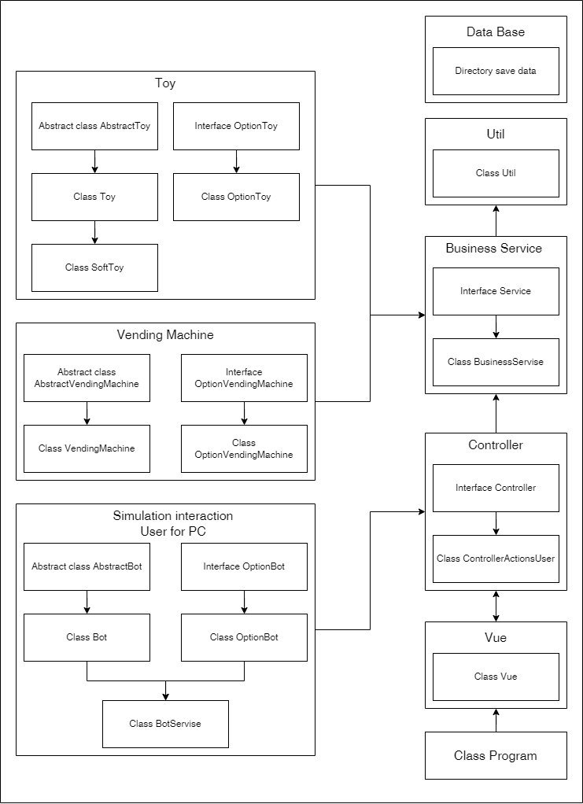
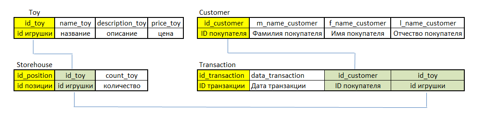

# Магазин игрушек
___

__#Задание:__

Реализовать приложение _"Магазин игрушек"_. 

__#Критерии:__

1) Магазин регулярно продает и пополняет товары;
2) Данные о товарах хрянятся в базе данных;
3) База данных должна сохранять данные о транзакциях;
4) Проект должен иметь возможность расширения.

___

__#Реализация:__

1) Архитектура проекта

Архитектура проекта построенна на основе паттерна _"MVC"_. 
Такой тип архитектруры в первую очередь позволяет разделить логику приложения 
на несколько независимых уровней. Схема к построению архитектуры представленна 
на изображении ниже.

Слой _"Model"_ состоит из двух независимых линий сущностей - "Toy" и "Vending Machine".

* _"Toy"_ - представляет собой шаблон игрушки (далее реализуется мягкая игрушка).

* _"Vending Machine"_ - представляет собой шаблон торгового автомата.

В проекте исключено поведение сущностей (которое можно было бы реализовать в паттерне _"Стратегия"_),
но разделенно физическое описание и действия, которые можно выполнять с объектами.

Инициализация шаблонов слоя _"Model"_ и взаимодействие сущностей происходит в слое _"Business Service"_. 
Здесь же реализуется двунаправленная связь с _"Базой данных"_.

Команды для выполнения действий, которые необходимо выполнить в _"Business Service"_, 
поступают из слоя _"Controller"_, который в первую очередь является посредником между пользователем
и приложением, а во вторую очередь является обработчиком полученных данных от пользователя.

Пользовательское представление реализуется в слое _"Vue"_. Этот слой напрямую взаимодействует с 
пользователем, предостовляя ему пользовательский интерфейс (консоль).

2) Архитектура базы данных

База данных реализована с помощью _"MySQL"_. База данных является реляционной, все сущности связываются ключами.
Архитектура базы данных представленна на изображении ниже.

* Сущность _"Toy"_ содержит в себе данные о видах игрушек; 

* Сущность _"Storehouse"_ содержит данные о количестве игрушек в наличие;

* Сущность _"Customer"_ содержит данные о покупателе;

* Сущность _"Transaction"_ содержит данные о совершенной покупке.

Данные в сущности _"Toy"_ инициализируются при запуске приложения, если они отсутствуют.
После чего, инициализирируется сущность _"Storehouse"_, которая содержит в себе данные о количестве игрушек.
Данные о покупках появляются в сущности _"Transaction"_ вместе с данными о покупателе в сущности _"Customer"_.
Перед добавлением данных о покупателе, проверяется отсутствие записи о нем.

3) Автоматизация пользовательской части

Для проверки динамики проекта принято решение о создание ботов, которые будут имитировать поведение
покупателя. Инициализация ботов происходит в слое "Simulation interaction User for PC". 
Боты напрямую взаимодействуют со слоем _"Controller"_, а пользователю только предстовляется вывод о
совершенных действиях. Боты генерируются с определенной частотой в реальном времени.

4) Краткое описание взаимодействий

Сразу после запуска приложения, инициализируются данные из БД. Если данные отсутствуют, то БД заполняется 
тестовыми данными.
Далее, происходит инициализации бота, который сразу же производит покупку случайной игрушки. 
Одновременно с покупкой игрушки, происходит заполнение данных о покупателе, если он отсутствует в клиентской базе.
Затем в базу данных вносятся данные о транзакции.
Параллельно с работой ботов, сервис с определенной переодичностью проверяет количество игрушек на складе.

Игрушка не может отсутствовать на складе: 
* проверка количества осуществляется чаще, чем происходит покупка;
* на сервисе реализованно обязательное пополнение игрушек.

После каждого выполненого действия или полученного результата, происходит оповещание пользователя в консоли.

По окончанию работы приложения выводится список всех транзакций.

    Представленная выше архитектура приложения во время реализации может быть изменена и модифицированна.
    Настройка MySQL для IDE - https://habr.com/ru/sandbox/146588/
    Настройка MySQL Workbench - https://dev.mysql.com/doc/workbench/en/wb-installing.html

